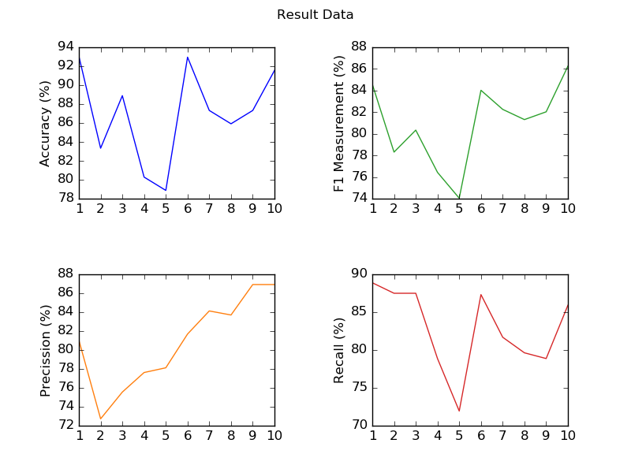

<h2 align="center">Long sort term memory</h2>
This program implementation lstm methode for classfication Sentiment-Analysis about hate speech and non hate speech in twitter. Dataset uses csv format file that contains collection of tweets about politics.  
Before trained, dataset will pass preprocess. Preprocess will remove unnecessary word, separate label and data, and change dataset from string to numeric because training process only accept numeric format.  

### Requirement :
- Python 3
- Numpy
- Matplotlib
- Scikit-learn
- Tensorflow
- Keras
  

### Screenshot :

  

### How to install?
1. Clone this project `git clone https://github.com/PajarKharisma/Python-BidirectionalLSTM.git`

2. Install all requirements. You can type `pip install -r requirements.txt` to install it.

3. copy `file/indonesian-sentimen` to `C:\\Users\\LiSA\\AppData\\Roaming\\nltk_data\\corpora\\stopwords\\`

4. For running, type `py main.py` inside src/main folder